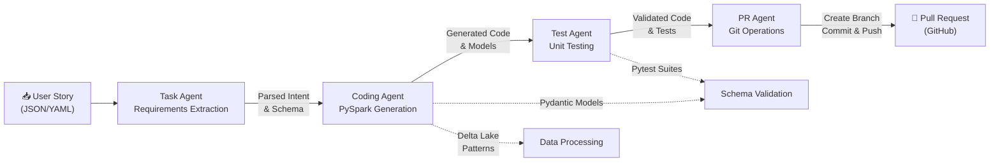
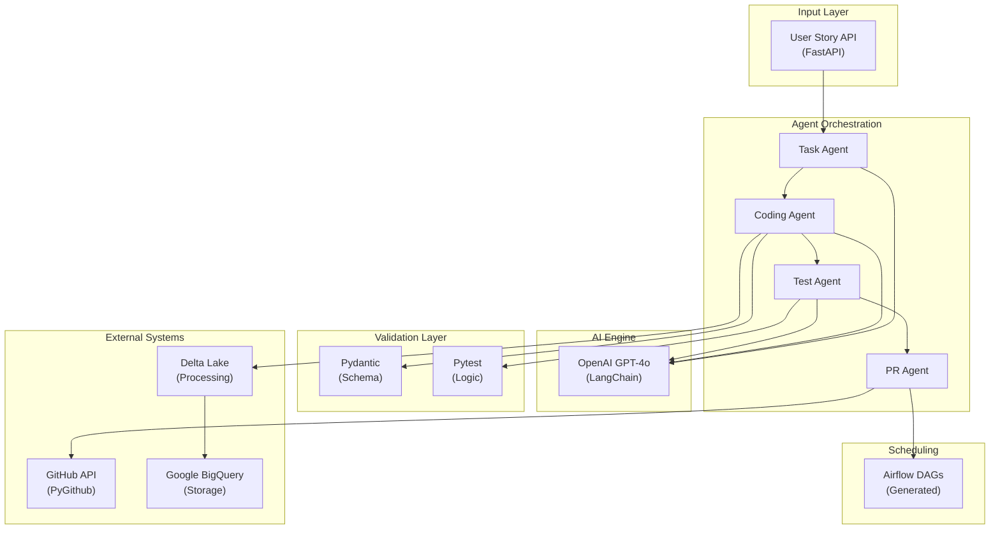

# Autonomous ETL/ELT Agent for DevOps-Driven Data Engineering

An AI-powered agentic system that automates the Data Engineering lifecycle—transforming DevOps user stories into production-ready, tested, and PR-ready Spark pipelines.

## 🚀 Project Overview

This system minimizes manual effort in the DE lifecycle by using **Agentic AI** to interpret requirements and generate code that aligns with organizational standards. It specifically targets the transition from a "User Story" to a "Pull Request" without human intervention for standard ETL tasks.

### Key Features
* **NLP Story Parsing:** Extracts transformation intent (filter, join, aggregate) from JSON/YAML DevOps tasks.
* **Automated Spark Generation:** Produces modular PySpark code using Delta Lake patterns.
* **Autonomous Validation:** Auto-generates and runs `pytest` suites including null-checks and schema assertions.
* **Git Automation:** Creates branches, commits code, and raises Pull Requests via GitHub API.
* **Orchestration Ready:** Generates minimal Airflow DAGs for immediate scheduling.

## 🏗 Architecture

The project utilizes a **Multi-Agent Orchestration** pattern powered by **LangGraph**:
1. **Task Agent:** Requirements extraction & mapping.
2. **Coding Agent:** PySpark & Pydantic model generation.
3. **Test Agent:** Unit testing & business logic validation.
4. **PR Agent:** Repository operations & documentation.

### Orchestration Flow



### System Integration



### Integration Points

**Agent Responsibilities**
- **Task Agent:** Parses DevOps user stories and extracts transformation intent (filters, joins, aggregations) into structured requirements
- **Coding Agent:** Generates modular PySpark code using Delta Lake patterns and produces Pydantic models for schema definition
- **Test Agent:** Auto-generates pytest suites including null-checks, schema assertions, and business logic validation
- **PR Agent:** Handles Git operations—creates branches, commits code with descriptions, and raises Pull Requests via GitHub API

**Data Flow & Dependencies**
- Task Agent runs first, producing structured intent that flows to Coding Agent
- Coding Agent generates code and models in parallel with Validation Layer setup
- Test Agent validates generated code before PR Agent commits
- All agents leverage OpenAI GPT-4o via LangChain for NLP and code generation
- Output automatically integrates with Airflow for scheduling and BigQuery for storage

**Tech Stack Integration**
- **LangGraph** orchestrates agent sequencing and state management
- **Pydantic** enforces schema validation on generated models
- **Pytest** runs auto-generated test suites with configurable assertions
- **FastAPI** provides the REST API entry point for user stories
- **Delta Lake & BigQuery** handle data processing and storage respectively

## 🛠 Tech Stack
* **AI Engine:** OpenAI GPT-4o / LangChain / LangGraph
* **Data Processing:** Apache Spark (PySpark) & Delta Lake
* **Data Warehouse:** Google BigQuery (Storage & Ingestion)
* **Validation:** Pydantic (Schema) & Pytest (Logic)
* **API/Web:** FastAPI & Uvicorn
* **DevOps:** GitHub API (PyGithub)

## 📂 Project Structure
```text
├── src/                # Core Agent logic and FastAPI endpoints
├── framework/          # Predefined DE standards and templates
├── tests/              # Test suites for the Agent and generated code
├── orchestration/      # Airflow DAG templates
├── docs/               # Architecture diagrams and runbooks
└── .env.example        # Environment variables (GCP/OpenAI/GitHub)
```
