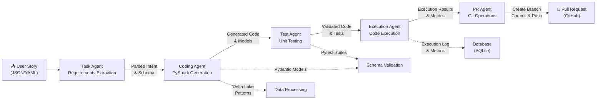
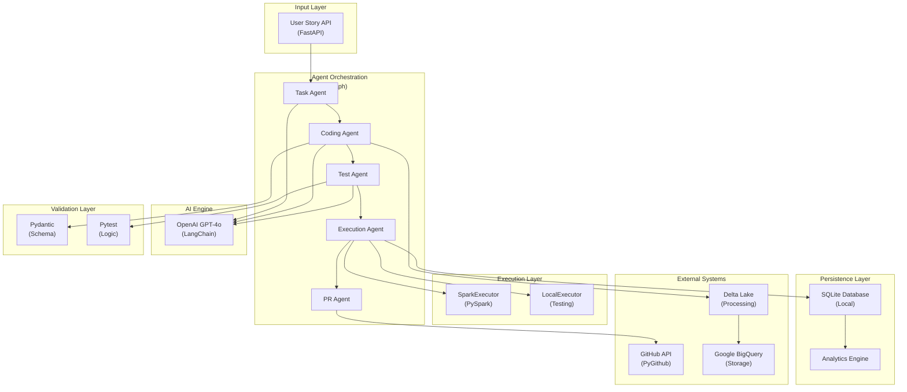

# Autonomous ETL/ELT Agent for DevOps-Driven Data Engineering

An AI-powered agentic system that automates the Data Engineering lifecycle—transforming DevOps user stories into production-ready, tested, and PR-ready Spark pipelines.

## 🚀 Project Overview

This system minimizes manual effort in the DE lifecycle by using **Agentic AI** to interpret requirements and generate code that aligns with organizational standards. It specifically targets the transition from a "User Story" to a "Pull Request" without human intervention for standard ETL tasks.

### Key Features
* **NLP Story Parsing:** Extracts transformation intent (filter, join, aggregate) from JSON/YAML DevOps tasks.
* **Automated Spark Generation:** Produces modular PySpark code using Delta Lake patterns.
* **Autonomous Validation:** Auto-generates and runs `pytest` suites including null-checks and schema assertions.
* **Code Execution:** Safely executes generated PySpark code with error recovery and metrics capture.
* **Data Lineage Tracking:** Extracts and visualizes data flows with OpenLineage protocol compliance for full data governance.
* **Persistent Storage:** SQLite database tracks all executions with full audit trail and analytics.
* **Git Automation:** Creates branches, commits code, and raises Pull Requests via GitHub API.
* **REST API:** FastAPI endpoints for pipeline creation, querying, analytics, and lineage visualization.

## 🏗 Architecture

The project utilizes a **Multi-Agent Orchestration** pattern powered by **LangGraph**:
1. **Task Agent:** Requirements extraction & mapping.
2. **Coding Agent:** PySpark & Pydantic model generation.
3. **Test Agent:** Unit testing & business logic validation.
4. **Execution Agent:** Code execution with safety sandboxing and metrics capture.
5. **PR Agent:** Repository operations & documentation.

### Orchestration Flow



### System Integration



### Integration Points

**Agent Responsibilities**
- **Task Agent:** Parses DevOps user stories and extracts transformation intent (filters, joins, aggregations) into structured requirements
- **Coding Agent:** Generates modular PySpark code using Delta Lake patterns and produces Pydantic models for schema definition
- **Test Agent:** Auto-generates pytest suites including null-checks, schema assertions, and business logic validation
- **Execution Agent:** Safely executes generated PySpark code via SparkExecutor or LocalExecutor with error recovery; captures metrics and logs
- **PR Agent:** Handles Git operations—creates branches, commits code with descriptions, and raises Pull Requests via GitHub API

**Data Flow & Dependencies**
- Task Agent runs first, producing structured intent that flows to Coding Agent
- Coding Agent generates code and models in parallel with Validation Layer setup
- Test Agent validates generated code before Execution Agent runs
- Execution Agent safely runs code with sandboxing; failures don't block PR creation (graceful degradation)
- All agents leverage OpenAI GPT-4o via LangChain for NLP and code generation
- Execution results and full audit trail persisted to SQLite database
- Analytics engine provides querying capabilities and pipeline metrics

**Persistence & Observability**
- SQLite database stores all pipeline executions with metadata (execution_id, status, duration, quality scores, logs)
- RESTful analytics endpoints enable metrics querying and execution history review
- Execution logs track all agent outputs and any errors encountered
- Quality scores calculated per-agent and aggregated for overall pipeline metrics

**Tech Stack Integration**
- **LangGraph** orchestrates agent sequencing and state management
- **Pydantic** enforces schema validation on generated models
- **Pytest** runs auto-generated test suites with configurable assertions
- **FastAPI** provides REST API for pipeline creation and querying
- **SQLAlchemy** ORM provides type-safe database access and migrations
- **Delta Lake & BigQuery** handle data processing and storage respectively
- **SparkExecutor** safely runs PySpark code with environment isolation

## 🛠 Tech Stack
* **AI Engine:** OpenAI GPT-4o / LangChain / LangGraph
* **Data Processing:** Apache Spark (PySpark) & Delta Lake
* **Data Warehouse:** Google BigQuery (Storage & Ingestion)
* **Validation:** Pydantic (Schema) & Pytest (Logic)
* **API/Web:** FastAPI & Uvicorn
* **Database:** SQLite with SQLAlchemy 2.0 ORM & Alembic migrations
* **DevOps:** GitHub API (PyGithub)

## 📂 Project Structure
```text
├── src/
│   ├── agents/               # Task, Coding, Test, Execution, PR agents
│   ├── database/             # SQLAlchemy models, repository pattern, initialization
│   ├── execution/            # SparkExecutor, LocalExecutor, ExecutionAgent
│   ├── lineage/              # Data lineage extraction and OpenLineage event emission
│   ├── orchestration.py      # Multi-agent orchestration and state management
│   ├── api.py                # FastAPI endpoints and REST interface
│   ├── config.py             # Configuration and environment variables
│   └── types.py              # Shared TypedDict and Pydantic models
├── tests/
│   ├── test_task_agent.py    # Unit and integration tests
│   ├── conftest.py           # pytest fixtures and setup
│   └── __init__.py
├── docs/                     # Architecture diagrams and implementation guides
├── pytest.ini                # pytest configuration
├── requirements.txt          # Python dependencies
├── .env.example              # Environment variables template (NEVER commit .env)
└── README.md                 # This file
```

## 🚀 Quick Start

### Prerequisites
- Python 3.12+
- Apache Spark 3.5.0+ (for code execution)
- OpenAI API key
- GitHub PAT token (for PR operations)

### Installation

1. **Clone the repository:**
```bash
git clone <your-repo-url>
cd autonomous_ETL_ELT_DevOps_Project
```

2. **Create environment variables:**
```bash
cp .env.example .env
# Edit .env with your credentials:
# - OPENAI_API_KEY
# - GITHUB_TOKEN
# - GITHUB_REPO_URL
```

3. **Install dependencies:**
```bash
pip install -r requirements.txt
```

4. **Initialize database:**
```bash
python -c "from src.database.db import init_db; init_db()"
```

5. **Start the API server (Terminal 1):**
```bash
python -m uvicorn src.api:app --reload
```

Server runs at `http://localhost:8000`

6. **Launch the Streamlit UI (Terminal 2):**
```bash
streamlit run streamlit_app.py
```

Dashboard opens at `http://localhost:8501`

---

## 🎯 Interactive Dashboard

The **Streamlit UI** provides a user-friendly interface to submit user stories and track pipeline execution:

### Features
- **📝 Submit User Stories** - Natural language requirements with source/target systems
- **🤖 View Agent Outputs** - See generated code, tests, and PR details
- **📊 Pipeline History** - Browse all past executions with filtering
- **📈 Analytics** - Aggregate metrics, quality scores, success rates
- **🔗 Data Lineage** - Track data flows and transformations

### Demo Flow
1. Go to **Tab 1: Submit User Story**
2. Fill in user story details (title, description, systems, quality rules)
3. Click **"🚀 Submit Story & Generate Pipeline"**
4. Watch as 5 agents execute in sequence:
   - ✏️ Task Agent - Requirements parsing
   - 🔧 Coding Agent - PySpark code generation
   - ✅ Test Agent - Unit test creation
   - ⚡ Execution Agent - Code execution & metrics
   - 📤 PR Agent - GitHub PR creation
5. View all agent outputs with syntax highlighting
6. Check **Tab 2** for execution history, **Tab 3** for analytics, **Tab 4** for lineage

### Example User Story
```
Title: Transform Customer Orders to Analytics
Description: Load customer orders from Salesforce, join with product data, 
             filter for last 12 months, aggregate by customer to calculate 
             total orders, revenue, and average order value
Source: Salesforce CRM
Target: Snowflake Data Warehouse
```

See [DEMO_GUIDE.md](DEMO_GUIDE.md) for more detailed examples and instructions.

---

## 📡 API Endpoints

### Pipeline Execution

**POST** `/pipelines/demo` (Recommended for testing/demos)
- Returns mock pipeline execution with sample outputs instantly
- No OpenAI API calls required
- Perfect for UI testing and demonstrations
- Response: Complete execution with generated code, tests, and metrics

**POST** `/pipelines/create` (Production)
- Creates and executes a new pipeline with full agent orchestration
- Requires OpenAI API key and GitHub token
- Uses all 5 agents: Task, Coding, Test, Execution, PR
- Response: Real generated PySpark code and artifacts

### Pipeline Queries
**GET** `/pipelines`
- Lists all executed pipelines with pagination
- Query params: `limit` (default 10), `offset` (default 0), `status` (optional: success/failed)
- Response: `{total: int, pipelines: [PipelineExecution, ...]}`

**GET** `/pipelines/{execution_id}`
- Retrieves full details of a specific execution
- Response: Complete `PipelineExecution` with parsed requirements, generated code, tests, execution log, PR details

### Analytics
**GET** `/pipelines/analytics/summary`
- Aggregated metrics across all executions
- Response: `{total_executions, successful, failed, success_rate, average_quality}`

**GET** `/pipelines/analytics/by-status`
- Statistics grouped by execution status
- Response: `{status: count, ...}`

### Data Lineage (NEW)
**GET** `/pipelines/{execution_id}/lineage`
- Retrieves extracted lineage data for a specific pipeline execution
- Response: `{sources: [...], targets: [...], transformations: [...]}`
- Includes OpenLineage-compliant event data for visualization tools

**GET** `/lineage/datasets`
- Discovers all datasets across all pipeline executions
- Query params: `limit`, `offset`
- Response: List of all source and target datasets with location and format information

**GET** `/lineage/transformations`
- Discovers all transformation operations across executions
- Response: List of all operations (filter, join, aggregate, select, union) with input/output mapping

**GET** `/lineage/graph/{execution_id}`
- Returns DAG (Directed Acyclic Graph) representation of data lineage
- Response: `{nodes: [...], edges: [...]}` suitable for visualization tools
- Nodes represent datasets/transformations; edges represent data flow

### Health Check
**GET** `/health`
- System health status
- Response: `{status: "ok"}`

## 💾 Database Schema

The SQLite database (`etl_agent.db`) stores:
- **Execution metadata:** execution_id, status, duration, timestamps
- **Agent outputs:** parsed_requirements, generated_code, generated_tests, pull_request_details
- **Execution logs:** execution_result, execution_status, system logs
- **Quality metrics:** Per-agent scores (task, code, test, execution, pr) and overall quality

All executions are persisted for audit trailing and historical analysis. Use `/pipelines` endpoints to query the database.

## � Data Lineage & Governance

The system includes comprehensive data lineage tracking for full observability of data transformations according to OpenLineage standards.

### Lineage Extraction

The **LineageExtractor** automatically analyzes generated PySpark code to identify:
- **Source Datasets:** All `spark.read.*` operations (CSV, Parquet, JSON, ORC, Delta)
- **Target Datasets:** All `df.write.save()` operations with format inference
- **Transformations:** Automatically detected operations including:
  - **Filter:** `df.filter()` with condition extraction
  - **Select:** `df.select()` with column mapping
  - **Join:** `df.join()` with join keys and input tracking
  - **Aggregate:** `df.groupBy().agg()` operations
  - **Union:** `df.union()` combining multiple sources

### Lineage Events

The **LineageEmitter** generates OpenLineage-compliant events:
- **START Event:** Emitted when execution begins with input dataset information
- **COMPLETE Event:** Emitted when execution finishes with status and output datasets
- **Lineage Data:** Full transformation graph with source→target mappings for visualization

### Visualization & Discovery

**Lineage Query Endpoints:**
- Retrieve lineage for specific executions via `/pipelines/{id}/lineage`
- Discover all datasets across executions via `/lineage/datasets`
- Identify transformation patterns via `/lineage/transformations`
- Export DAG structure for visualization via `/lineage/graph/{id}`

**Integration Points:**
- OpenLineage-compliant events can be sent to external tools (Maroochy, OpenDataDiscovery, etc.)
- DAG endpoints provide `nodes` and `edges` suitable for graph visualization libraries
- SQL queries on database can reconstruct complete lineage history

### Example: Tracking a Pipeline

For a pipeline that reads customers and orders, joins them, and aggregates:

```python
# Code execution
df_customers = spark.read.parquet("s3://data/customers.parquet")
df_orders = spark.read.parquet("s3://data/orders.parquet")
df_joined = df_customers.join(df_orders, on="customer_id")
df_summary = df_joined.groupBy("customer_id").agg(count("*"))
df_summary.write.format("parquet").save("s3://output/customer_summary.parquet")
```

**Lineage Extracted:**
- **Sources:** customers, orders
- **Targets:** customer_summary
- **Transformations:** join (2 inputs), aggregate (1 input)
- **OpenLineage DAG:** Nodes=[customers, orders, joined, summary], Edges=[customers→joined, orders→joined, joined→summary]

### Data Governance Benefits

- **Compliance:** Track data lineage for regulatory requirements (GDPR, CCPA, SOX)
- **Impact Analysis:** Identify downstream pipelines affected by upstream data changes
- **Quality Monitoring:** Correlate data quality issues with transformation steps
- **Access Control:** Understand data flow for security and access policies
- **Documentation:** Automatically generated lineage serves as pipeline documentation
- **Troubleshooting:** Trace issues back to source datasets and transformations

## �🔒 Security

- **Credentials:** Never commit `.env` — use `.gitignore` to protect secrets
- **API Keys:** Store in environment variables, rotate exposed keys immediately  
- **Code Execution:** ExecutionAgent runs PySpark code in isolated environment with timeout (5 min) and error recovery
- **Database:** SQLite for development; PostgreSQL recommended for production with encryption

## 🚀 Deployment & Production Readiness

### Docker Setup

The project includes containerized deployment with:
- **Multi-stage Dockerfile** — Optimized image with Python 3.12 and Java 17 for Spark
- **Docker Compose** — PostgreSQL + API service orchestration
- **Environment overrides** — Different configs for dev/staging/production

### Local Docker Development

1. **Build and run with PostgreSQL:**
```bash
docker-compose up --build
```

2. **Development mode (with hot-reload):**
```bash
# Auto-applies docker-compose.override.yml
docker-compose up --build
# Edit src/ files and see changes instantly
```

3. **Access services:**
- API: `http://localhost:8000`
- Health: `http://localhost:8000/health`
- PostgreSQL: `localhost:5432` (from host) or `postgres:5432` (from containers)
- Logs: `./logs/` directory

4. **Stop and cleanup:**
```bash
docker-compose down
docker-compose down -v  # Also remove data volumes
```

### Production Deployment

#### Environment Configuration

```bash
# Set environment variables (use secure secret manager in production)
export ENVIRONMENT=production
export LOG_LEVEL=WARNING
export DB_DRIVER=postgresql
export DB_HOST=prod-postgres.example.com
export DB_USER=etl_prod_user
export DB_PASSWORD=<secure-password>
export OPENAI_API_KEY=<your-key>
export GITHUB_TOKEN=<your-token>
```

#### Docker Production Build

```bash
# Build optimized image
docker build -t etl-agent:latest .
docker tag etl-agent:latest etl-agent:1.0.0

# Push to registry
docker push your-registry/etl-agent:1.0.0
```

#### Kubernetes Deployment

Create `k8s/deployment.yaml`:
```yaml
apiVersion: apps/v1
kind: Deployment
metadata:
  name: etl-api
spec:
  replicas: 3
  selector:
    matchLabels:
      app: etl-api
  template:
    metadata:
      labels:
        app: etl-api
    spec:
      containers:
      - name: api
        image: your-registry/etl-agent:1.0.0
        ports:
        - containerPort: 8000
        env:
        - name: ENVIRONMENT
          value: production
        - name: DATABASE_URL
          valueFrom:
            secretKeyRef:
              name: etl-secrets
              key: database-url
        - name: OPENAI_API_KEY
          valueFrom:
            secretKeyRef:
              name: etl-secrets
              key: openai-key
        livenessProbe:
          httpGet:
            path: /health
            port: 8000
          initialDelaySeconds: 30
          periodSeconds: 10
        readinessProbe:
          httpGet:
            path: /health
            port: 8000
          initialDelaySeconds: 10
          periodSeconds: 5
```

Deploy with:
```bash
kubectl apply -f k8s/deployment.yaml
kubectl apply -f k8s/service.yaml
```

#### Cloud Deployment (AWS/GCP/Azure)

##### AWS ECS

```bash
# Create ECR repository
aws ecr create-repository --repository-name etl-agent

# Push image
docker tag etl-agent:latest $AWS_ACCOUNT.dkr.ecr.$AWS_REGION.amazonaws.com/etl-agent:latest
docker push $AWS_ACCOUNT.dkr.ecr.$AWS_REGION.amazonaws.com/etl-agent:latest

# Create RDS PostgreSQL instance
aws rds create-db-instance \
  --db-instance-identifier etl-agent-db \
  --engine postgres \
  --db-instance-class db.t3.micro
```

##### Google Cloud Run

```bash
# Build and push to Artifact Registry
gcloud builds submit --tag us-central1-docker.pkg.dev/$PROJECT/etl-agent/api:latest

# Deploy to Cloud Run
gcloud run deploy etl-api \
  --image us-central1-docker.pkg.dev/$PROJECT/etl-agent/api:latest \
  --platform managed \
  --memory 2Gi \
  --cpu 2 \
  --set-env-vars ENVIRONMENT=production,DATABASE_URL=$DB_URL
```

### Production Checklist

- [ ] Use PostgreSQL database (not SQLite)
- [ ] Enable encryption at rest and in transit (TLS/HTTPS)
- [ ] Use AWS Secrets Manager / GCP Secret Manager / Azure Key Vault for credentials
- [ ] Set `LOG_LEVEL=WARNING` or `ERROR`
- [ ] Enable application monitoring (CloudWatch, Stackdriver, Application Insights)
- [ ] Set up log aggregation (CloudWatch Logs, ELK Stack, Datadog)
- [ ] Configure health checks for load balancers
- [ ] Enable auto-scaling based on CPU/memory metrics
- [ ] Set up backup and disaster recovery for database
- [ ] Enable audit logging for compliance
- [ ] Use read replicas for high availability
- [ ] Implement rate limiting for API endpoints
- [ ] Set up alerting for errors and performance degradation
- [ ] Document runbooks for common operations
- [ ] Plan for failover and recovery procedures
- [ ] Regular security audits and penetration testing

### Monitoring & Logging

The system includes structured logging with:
- **JSON format** in production for easy parsing by log aggregation tools
- **Separate error logs** for quick issue identification
- **Automatic log rotation** every 500MB
- **Health check endpoint** (`GET /health`) for monitoring systems

Health check response includes:
- API status
- Database connectivity
- Environment information
- Current database driver (SQLite/PostgreSQL)

### Database Migrations

Using Alembic for schema versioning:

```bash
# Generate migration after model changes
alembic revision --autogenerate -m "Add new_field to table"

# Apply migrations
alembic upgrade head

# Rollback one migration
alembic downgrade -1
```

## 🧪 Testing

Run the test suite:
```bash
pytest -v --cov=src
```

Individual test files:
```bash
pytest tests/test_task_agent.py -v
```

Docker testing:
```bash
# Run tests in container
docker-compose -f docker-compose.yml up api
# Wait for startup, then in another terminal:
docker-compose exec api pytest -v
```
