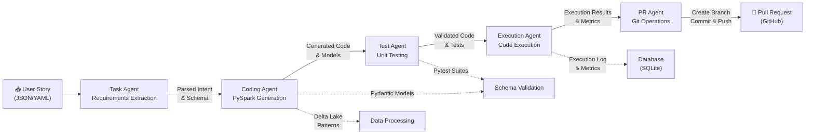
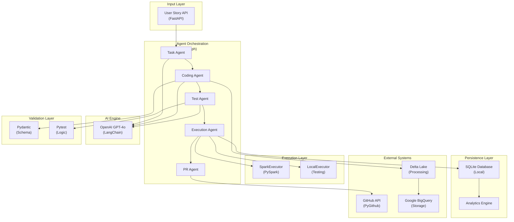

# Autonomous ETL/ELT Agent for DevOps-Driven Data Engineering

An AI-powered agentic system that automates the Data Engineering lifecycle—transforming DevOps user stories into production-ready, tested, and PR-ready Spark pipelines.

## 🚀 Project Overview

This system minimizes manual effort in the DE lifecycle by using **Agentic AI** to interpret requirements and generate code that aligns with organizational standards. It specifically targets the transition from a "User Story" to a "Pull Request" without human intervention for standard ETL tasks.

### Key Features
* **NLP Story Parsing:** Extracts transformation intent (filter, join, aggregate) from JSON/YAML DevOps tasks.
* **Automated Spark Generation:** Produces modular PySpark code using Delta Lake patterns.
* **Autonomous Validation:** Auto-generates and runs `pytest` suites including null-checks and schema assertions.
* **Code Execution:** Safely executes generated PySpark code with error recovery and metrics capture.
* **Persistent Storage:** SQLite database tracks all executions with full audit trail and analytics.
* **Git Automation:** Creates branches, commits code, and raises Pull Requests via GitHub API.
* **REST API:** FastAPI endpoints for pipeline creation, querying, and analytics.

## 🏗 Architecture

The project utilizes a **Multi-Agent Orchestration** pattern powered by **LangGraph**:
1. **Task Agent:** Requirements extraction & mapping.
2. **Coding Agent:** PySpark & Pydantic model generation.
3. **Test Agent:** Unit testing & business logic validation.
4. **Execution Agent:** Code execution with safety sandboxing and metrics capture.
5. **PR Agent:** Repository operations & documentation.

### Orchestration Flow



### System Integration



### Integration Points

**Agent Responsibilities**
- **Task Agent:** Parses DevOps user stories and extracts transformation intent (filters, joins, aggregations) into structured requirements
- **Coding Agent:** Generates modular PySpark code using Delta Lake patterns and produces Pydantic models for schema definition
- **Test Agent:** Auto-generates pytest suites including null-checks, schema assertions, and business logic validation
- **Execution Agent:** Safely executes generated PySpark code via SparkExecutor or LocalExecutor with error recovery; captures metrics and logs
- **PR Agent:** Handles Git operations—creates branches, commits code with descriptions, and raises Pull Requests via GitHub API

**Data Flow & Dependencies**
- Task Agent runs first, producing structured intent that flows to Coding Agent
- Coding Agent generates code and models in parallel with Validation Layer setup
- Test Agent validates generated code before Execution Agent runs
- Execution Agent safely runs code with sandboxing; failures don't block PR creation (graceful degradation)
- All agents leverage OpenAI GPT-4o via LangChain for NLP and code generation
- Execution results and full audit trail persisted to SQLite database
- Analytics engine provides querying capabilities and pipeline metrics

**Persistence & Observability**
- SQLite database stores all pipeline executions with metadata (execution_id, status, duration, quality scores, logs)
- RESTful analytics endpoints enable metrics querying and execution history review
- Execution logs track all agent outputs and any errors encountered
- Quality scores calculated per-agent and aggregated for overall pipeline metrics

**Tech Stack Integration**
- **LangGraph** orchestrates agent sequencing and state management
- **Pydantic** enforces schema validation on generated models
- **Pytest** runs auto-generated test suites with configurable assertions
- **FastAPI** provides REST API for pipeline creation and querying
- **SQLAlchemy** ORM provides type-safe database access and migrations
- **Delta Lake & BigQuery** handle data processing and storage respectively
- **SparkExecutor** safely runs PySpark code with environment isolation

## 🛠 Tech Stack
* **AI Engine:** OpenAI GPT-4o / LangChain / LangGraph
* **Data Processing:** Apache Spark (PySpark) & Delta Lake
* **Data Warehouse:** Google BigQuery (Storage & Ingestion)
* **Validation:** Pydantic (Schema) & Pytest (Logic)
* **API/Web:** FastAPI & Uvicorn
* **Database:** SQLite with SQLAlchemy 2.0 ORM & Alembic migrations
* **DevOps:** GitHub API (PyGithub)

## 📂 Project Structure
```text
├── src/
│   ├── agents/               # Task, Coding, Test, Execution, PR agents
│   ├── database/             # SQLAlchemy models, repository pattern, initialization
│   ├── execution/            # SparkExecutor, LocalExecutor, ExecutionAgent
│   ├── orchestration.py      # Multi-agent orchestration and state management
│   ├── api.py                # FastAPI endpoints and REST interface
│   ├── config.py             # Configuration and environment variables
│   └── types.py              # Shared TypedDict and Pydantic models
├── tests/
│   ├── test_task_agent.py    # Unit and integration tests
│   ├── conftest.py           # pytest fixtures and setup
│   └── __init__.py
├── docs/                     # Architecture diagrams and implementation guides
├── pytest.ini                # pytest configuration
├── requirements.txt          # Python dependencies
├── .env.example              # Environment variables template (NEVER commit .env)
└── README.md                 # This file
```

## 🚀 Quick Start

### Prerequisites
- Python 3.12+
- Apache Spark 3.5.0+ (for code execution)
- OpenAI API key
- GitHub PAT token (for PR operations)

### Installation

1. **Clone the repository:**
```bash
git clone <your-repo-url>
cd autonomous_ETL_ELT_DevOps_Project
```

2. **Create environment variables:**
```bash
cp .env.example .env
# Edit .env with your credentials:
# - OPENAI_API_KEY
# - GITHUB_TOKEN
# - GITHUB_REPO_URL
```

3. **Install dependencies:**
```bash
pip install -r requirements.txt
```

4. **Initialize database:**
```bash
python -c "from src.database.db import init_db; init_db()"
```

5. **Start the API server:**
```bash
python -m uvicorn src.api:app --reload
```

Server runs at `http://localhost:8000`

## 📡 API Endpoints

### Pipeline Execution
**POST** `/pipelines/create`
- Creates and executes a new pipeline from user story
- Request body: `{"task_description": "user story text", "data_schema": {...}}`
- Response: Full execution result with 5-agent outputs and metrics
- Status: 201 Created

### Pipeline Queries
**GET** `/pipelines`
- Lists all executed pipelines with pagination
- Query params: `limit` (default 10), `offset` (default 0), `status` (optional: success/failed)
- Response: `{total: int, pipelines: [PipelineExecution, ...]}`

**GET** `/pipelines/{execution_id}`
- Retrieves full details of a specific execution
- Response: Complete `PipelineExecution` with parsed requirements, generated code, tests, execution log, PR details

### Analytics
**GET** `/pipelines/analytics/summary`
- Aggregated metrics across all executions
- Response: `{total_executions, successful, failed, success_rate, average_quality}`

**GET** `/pipelines/analytics/by-status`
- Statistics grouped by execution status
- Response: `{status: count, ...}`

### Health Check
**GET** `/health`
- System health status
- Response: `{status: "ok"}`

## 💾 Database Schema

The SQLite database (`etl_agent.db`) stores:
- **Execution metadata:** execution_id, status, duration, timestamps
- **Agent outputs:** parsed_requirements, generated_code, generated_tests, pull_request_details
- **Execution logs:** execution_result, execution_status, system logs
- **Quality metrics:** Per-agent scores (task, code, test, execution, pr) and overall quality

All executions are persisted for audit trailing and historical analysis. Use `/pipelines` endpoints to query the database.

## 🔒 Security

- **Credentials:** Never commit `.env` — use `.gitignore` to protect secrets
- **API Keys:** Store in environment variables, rotate exposed keys immediately  
- **Code Execution:** ExecutionAgent runs PySpark code in isolated environment with timeout (5 min) and error recovery
- **Database:** SQLite local storage; recommended to migrate to encrypted PostgreSQL for production

## 🧪 Testing

Run the test suite:
```bash
pytest -v --cov=src
```

Individual test files:
```bash
pytest tests/test_task_agent.py -v
```
