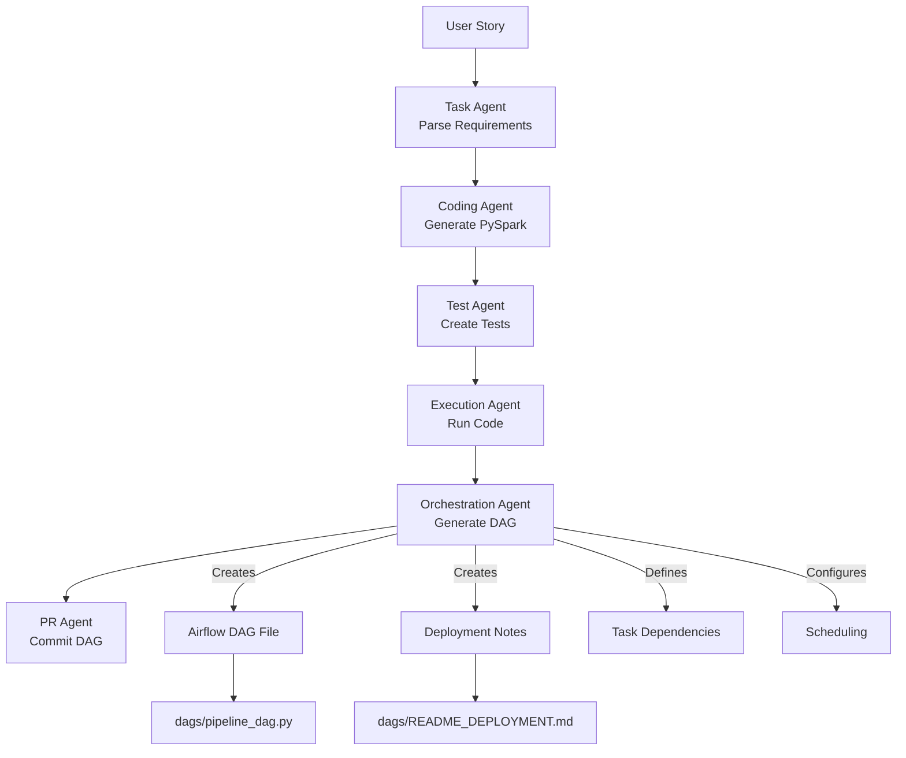

# Airflow DAG Orchestration

## Overview

The **Orchestration Agent** automatically generates production-ready Apache Airflow DAGs from user stories and generated PySpark code. This fulfills the critical data orchestration requirement (#7) by providing automated workflow scheduling and task dependency management.

## Features

### 🔄 Automatic DAG Generation
- Converts user stories into complete Airflow DAG Python files
- Generates task definitions with proper dependencies
- Includes validation, processing, and quality check tasks
- Supports multiple execution environments (Dataproc, Databricks, EMR, Synapse)

### 📋 Task Management
- **Validation Tasks**: Data source availability checks
- **Processing Tasks**: Spark job submission with proper configuration
- **Quality Tasks**: Output validation and business rule verification
- **Notification Tasks**: Success/failure alerts

### ⏰ Scheduling Configuration
- Configurable schedule intervals (daily, hourly, custom cron)
- Start date and catchup settings
- Retry logic with configurable delays
- Max active runs control

### 🏗️ Multi-Environment Support

Users can select their preferred Spark execution platform via the Streamlit UI, and the Orchestration Agent will generate platform-specific DAGs:

- **Google Cloud Dataproc** (`dataproc`): Uses DataprocSubmitJobOperator with cluster configuration
- **Databricks** (`databricks`): Uses DatabricksSubmitRunOperator with job clusters
- **AWS EMR** (`emr`): Uses EmrAddStepsOperator with step configurations
- **Azure Synapse** (`synapse`): Uses AzureSynapseRunSparkBatchOperator with Spark pool settings

**Compute Engine Selection in UI:**
The Streamlit dashboard includes a "Target Compute Platform" selector that allows users to choose their preferred execution environment. This selection is passed through the entire pipeline and influences:
- DAG operator selection
- Resource configuration recommendations
- Cost optimization strategies
- Platform-specific best practices

## Architecture



## Generated Artifacts

### 1. Airflow DAG File (`dags/<pipeline>_dag.py`)

Complete Python file with:
- DAG definition and configuration
- Task definitions using appropriate operators
- Task dependency setup
- Helper functions for validation and notifications
- Comprehensive documentation

**Example Structure:**
```python
from datetime import datetime, timedelta
from airflow import DAG
from airflow.operators.python import PythonOperator
from airflow.providers.google.cloud.operators.dataproc import DataprocSubmitJobOperator

default_args = {
    'owner': 'airflow',
    'retries': 3,
    'retry_delay': timedelta(minutes=5),
}

with DAG(
    dag_id='customer_order_pipeline',
    description='Daily customer order processing',
    default_args=default_args,
    schedule_interval='@daily',
    start_date=datetime(2024, 1, 1),
    catchup=False,
    tags=['etl', 'customer'],
) as dag:
    
    validate = PythonOperator(
        task_id='validate_input',
        python_callable=validate_sources,
    )
    
    process = DataprocSubmitJobOperator(
        task_id='run_pipeline',
        job_name='customer_orders',
        main_python_file_uri='gs://bucket/pipeline.py',
    )
    
    quality_check = PythonOperator(
        task_id='quality_check',
        python_callable=check_quality,
    )
    
    validate >> process >> quality_check
```

### 2. Deployment Documentation

Generated `README_DEPLOYMENT.md` includes:
- Prerequisites (Airflow version, providers)
- Required connections and variables
- Deployment steps
- Testing instructions
- Environment-specific configuration

## Quality Metrics

The Orchestration Agent calculates quality scores based on:

- ✅ **DAG Structure** (20%): Has proper tasks and descriptions
- ✅ **Dependencies** (20%): Tasks have correct dependency chains
- ✅ **Scheduling** (15%): Proper schedule configuration
- ✅ **Code Quality** (15%): Substantial, well-documented code
- ✅ **Validation** (15%): Includes data validation tasks
- ✅ **Documentation** (15%): Comprehensive descriptions

## Validation

Automatic validation checks:
- **Circular Dependencies**: Detects and prevents circular task dependencies
- **Missing Dependencies**: Ensures all referenced tasks exist
- **Orphaned Tasks**: Warns about isolated tasks
- **Syntax**: Validates DAG structure

## API Response

The generated orchestration is included in the pipeline response:

```json
{
  "execution_id": "abc-123",
  "status": "success",
  "orchestration_quality": 0.85,
  "generated_orchestration": {
    "dag_file_name": "customer_pipeline_dag.py",
    "dag_file_path": "dags/customer_pipeline_dag.py",
    "dag_code": "...",
    "airflow_dag": {
      "dag_id": "customer_pipeline",
      "description": "Daily customer processing",
      "schedule_config": {
        "schedule_interval": "@daily",
        "retries": 3
      },
      "tasks": [
        {
          "task_id": "validate",
          "operator": "PythonOperator"
        }
      ]
    },
    "deployment_notes": "...",
    "dependencies": [
      "apache-airflow-providers-google>=10.0.0"
    ]
  }
}
```

## Deployment

### Prerequisites

1. **Airflow 2.x** installed and running
2. **Required providers** (based on execution environment)
3. **Configured connections** (cloud provider, storage)
4. **Airflow variables** (bucket names, cluster configs)

### Deployment Steps

1. **Copy DAG file to Airflow DAGs folder:**
   ```bash
   cp dags/pipeline_dag.py $AIRFLOW_HOME/dags/
   ```

2. **Install dependencies:**
   ```bash
   pip install apache-airflow-providers-google
   ```

3. **Upload PySpark code to cloud storage:**
   ```bash
   # For Dataproc
   gsutil cp src/pipeline.py gs://your-bucket/pipelines/
   
   # For Databricks
   databricks fs cp src/pipeline.py dbfs:/pipelines/
   ```

4. **Configure connections in Airflow UI:**
   - Navigate to Admin → Connections
   - Add required connections (google_cloud_default, etc.)

5. **Set variables in Airflow UI:**
   - Navigate to Admin → Variables
   - Add required variables (gcs_bucket, cluster_name, etc.)

6. **Test the DAG:**
   ```bash
   airflow dags test pipeline_dag 2024-01-01
   ```

7. **Enable the DAG:**
   ```bash
   airflow dags unpause pipeline_dag
   ```

## Environment-Specific Configuration

### Google Cloud Dataproc

```python
from airflow.providers.google.cloud.operators.dataproc import DataprocSubmitJobOperator

DataprocSubmitJobOperator(
    task_id='run_spark_job',
    job_name='etl_job',
    cluster_name='{{ var.value.dataproc_cluster }}',
    main_python_file_uri='gs://{{ var.value.gcs_bucket }}/pipeline.py',
    region='us-central1',
)
```

### Databricks

```python
from airflow.providers.databricks.operators.databricks import DatabricksSubmitRunOperator

DatabricksSubmitRunOperator(
    task_id='run_spark_job',
    new_cluster={
        'spark_version': '11.3.x-scala2.12',
        'node_type_id': 'i3.xlarge',
        'num_workers': 2
    },
    spark_python_task={
        'python_file': 'dbfs:/pipelines/pipeline.py'
    },
)
```

### AWS EMR

```python
from airflow.providers.amazon.aws.operators.emr import EmrAddStepsOperator

EmrAddStepsOperator(
    task_id='run_spark_job',
    job_flow_id='{{ var.value.emr_cluster_id }}',
    steps=[{
        'Name': 'ETL Job',
        'ActionOnFailure': 'CONTINUE',
        'HadoopJarStep': {
            'Jar': 'command-runner.jar',
            'Args': ['spark-submit', 's3://bucket/pipeline.py']
        }
    }],
)
```

## Best Practices

### DAG Design
- ✅ Keep DAGs simple and focused
- ✅ Use meaningful task IDs
- ✅ Include comprehensive descriptions
- ✅ Tag DAGs for organization
- ✅ Set appropriate retries and timeouts

### Task Dependencies
- ✅ Use clear dependency chains
- ✅ Avoid circular dependencies
- ✅ Group related tasks
- ✅ Use sensors for external dependencies
- ✅ Implement proper error handling

### Scheduling
- ✅ Choose appropriate schedule intervals
- ✅ Set realistic retry delays
- ✅ Disable catchup unless needed
- ✅ Limit max active runs
- ✅ Use appropriate start dates

### Monitoring
- ✅ Include notification tasks
- ✅ Log important metrics
- ✅ Set up alerts for failures
- ✅ Monitor execution times
- ✅ Track data quality metrics

## Troubleshooting

### Common Issues

**1. DAG not appearing in UI**
- Check DAG file syntax: `python dags/pipeline_dag.py`
- Verify file is in `$AIRFLOW_HOME/dags/`
- Check Airflow logs: `airflow dags list`

**2. Connection errors**
- Verify connection configured in UI
- Test connection manually
- Check credentials and permissions

**3. Task failures**
- Review task logs in Airflow UI
- Verify cluster/environment is running
- Check resource availability
- Validate input data exists

**4. Import errors**
- Install required providers
- Check Python environment
- Verify module paths

## Examples

See the `examples/` directory for sample DAGs:
- `customer_rfm_analysis_dag.py` - Customer segmentation pipeline
- `log_aggregation_dag.py` - Log processing and aggregation
- `data_quality_dag.py` - Data quality validation workflow

## Future Enhancements

- 🔄 Support for Prefect and Dagster
- 📊 Cost optimization recommendations
- 🔍 Advanced dependency analysis
- 📝 Auto-generated DAG documentation
- 🧪 Integration testing for DAGs
- 📈 Performance monitoring dashboards
