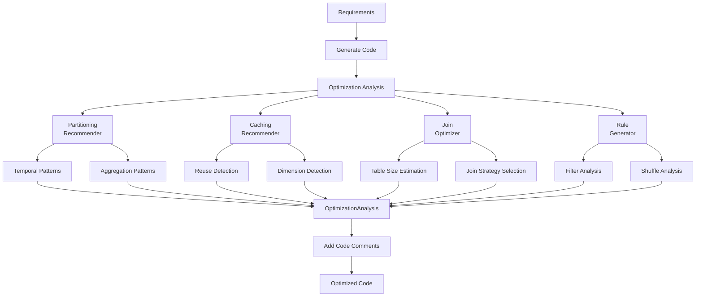

# Pipeline Optimization

## Overview

The **Coding Agent** automatically analyzes generated PySpark code and provides intelligent optimization recommendations to improve performance, reduce costs, and optimize resource utilization. This fulfills **Requirement #3** by providing automated pipeline optimization logic including partitioning, caching, and join strategies.

## Features

### 🚀 Automatic Optimization Analysis
- **Partitioning Recommendations**: Identifies optimal partitioning strategies based on data patterns
- **Caching Strategies**: Detects reusable DataFrames and recommends caching with appropriate storage levels
- **Join Optimizations**: Analyzes join patterns and recommends broadcast vs. sort-merge strategies
- **General Rules**: Provides filter pushdown, column pruning, and shuffle optimization tips

### 📊 Performance Categories

#### 1. Partitioning Recommendations
**Temporal Partitioning** (Range):
- Automatically detected for date/timestamp columns
- Benefits: 30-60% faster queries with date filters
- Recommended for time-series data

**Hash Partitioning**:
- Detected for groupBy/aggregation operations
- Benefits: 20-40% faster aggregations, reduced shuffle
- Typical partition count: 200

#### 2. Caching Recommendations
**Multiple Joins/Aggregations**:
- Detects intermediate results used multiple times
- Storage level: `MEMORY_AND_DISK` (fault-tolerant)
- Prevents expensive recomputation

**Dimension Tables**:
- Identifies small lookup tables
- Storage level: `MEMORY_ONLY` (fastest)
- Ideal for broadcast join candidates

#### 3. Join Optimizations
**Broadcast Join**:
- Recommended for tables < 10MB (dimension tables)
- Benefits: 60-80% faster joins, eliminates shuffle
- Automatically detects "dim_*" and "lookup_*" patterns

**Sort-Merge Join**:
- Recommended for large table joins (> 100MB)
- Requires proper partitioning on join keys
- Benefits: 30-50% faster with repartitioning

#### 4. General Optimization Rules

| Rule ID | Category | Priority | Impact |
|---------|----------|----------|--------|
| opt-001 | Filter Pushdown | High | 40-70% data reduction |
| opt-002 | Column Pruning | Medium | 20-30% memory reduction |
| opt-003 | Shuffle Optimization | High | 30-50% faster joins |
| opt-004 | Broadcast Hints | High | 60-80% faster small joins |
| opt-005 | Coalesce After Filter | Medium | 15-25% faster downstream |

## Architecture



## Generated Artifacts

### 1. Optimization Analysis Object

```python
{
  "overall_score": 0.85,  # 0-1 scale
  "partitioning_recommendations": [
    {
      "columns": ["order_date"],
      "reason": "Temporal data benefits from range partitioning",
      "estimated_benefit": "30-60% faster queries with date filters",
      "partition_type": "range",
      "num_partitions": null
    }
  ],
  "caching_recommendations": [
    {
      "dataframe_name": "joined_data",
      "reason": "Multiple joins detected - cache to avoid recomputation",
      "storage_level": "MEMORY_AND_DISK",
      "estimated_reuse_count": 3
    }
  ],
  "join_optimizations": [
    {
      "join_description": "inner join between orders and dim_customers",
      "optimization_type": "broadcast",
      "reason": "dim_customers is a dimension table - use broadcast join",
      "estimated_data_size": "< 10MB",
      "broadcast_threshold": "10MB"
    }
  ],
  "optimization_rules": [
    {
      "rule_id": "opt-001",
      "category": "filter_pushdown",
      "priority": "high",
      "title": "Apply filters early",
      "description": "Move filter operations as early as possible",
      "estimated_impact": "40-70% reduction in data processed"
    }
  ],
  "estimated_cost_reduction": "40-60% reduction in compute costs"
}
```

### 2. Inline Code Comments

Generated code includes optimization headers:

```python
# ============================================
# PERFORMANCE OPTIMIZATION RECOMMENDATIONS
# ============================================
# Overall Optimization Score: 0.85
# Estimated Cost Reduction: 40-60% reduction in compute costs
#
# PARTITIONING:
#   - Partition by order_date (range)
#     Reason: Temporal data benefits from range partitioning
#     Benefit: 30-60% faster queries with date filters
#
# CACHING:
#   - Cache 'joined_data' (MEMORY_AND_DISK)
#     Reason: Multiple joins detected - cache to avoid recomputation
#
# JOIN OPTIMIZATIONS:
#   - inner join between orders and dim_customers
#     Strategy: broadcast
#     Reason: dim_customers is a dimension table
#
# HIGH PRIORITY OPTIMIZATIONS:
#   - Apply filters early
#     Move filter operations as early as possible
#     Impact: 40-70% reduction in data processed
#   - Use broadcast joins for small tables
#     Use broadcast() hint for tables < 10MB
#     Impact: 60-80% faster joins
# ============================================

# Your PySpark code starts here...
```

## Quality Metrics

Optimization scores are calculated based on:

- ✅ **Partitioning** (10 pts per recommendation): Smart partitioning strategies
- ✅ **Caching** (10 pts per recommendation): Identified reuse opportunities
- ✅ **Join Optimization** (20 pts per optimization): Optimal join strategies
- ✅ **Base Score** (0.6): Starting point for any analyzed code

**Overall Score Thresholds**:
- 0.9-1.0: Excellent optimization potential
- 0.75-0.89: Good optimization coverage
- 0.6-0.74: Basic optimizations identified
- < 0.6: Limited optimization opportunities

## API Response

Optimization analysis is included in the Coding Agent output:

```json
{
  "agent_type": "CODING",
  "status": "SUCCESS",
  "data": {
    "generated_code": { ... },
    "code_quality_score": 0.92,
    "optimization_analysis": {
      "overall_score": 0.85,
      "partitioning_recommendations": [ ... ],
      "caching_recommendations": [ ... ],
      "join_optimizations": [ ... ],
      "optimization_rules": [ ... ],
      "estimated_cost_reduction": "40-60% reduction"
    }
  }
}
```

## Implementation Examples

### Example 1: Temporal Partitioning

**Input**: Daily order processing pipeline with date filters

**Generated Optimization**:
```python
# Partition by order_date for optimal date range queries
df.write.partitionBy("order_date").format("delta").save("output")
```

**Benefit**: 30-60% faster queries when filtering by date range

### Example 2: Broadcast Join

**Input**: Large fact table joining with small dimension table

**Generated Optimization**:
```python
from pyspark.sql.functions import broadcast

# Use broadcast join for dimension table (< 10MB)
result = large_df.join(broadcast(dim_df), on="customer_id")
```

**Benefit**: 60-80% faster joins, eliminates shuffle

### Example 3: Caching Strategy

**Input**: DataFrame used in multiple aggregations

**Generated Optimization**:
```python
# Cache intermediate results for reuse
aggregated_df = base_df.groupBy("category").agg(...)
aggregated_df.persist(StorageLevel.MEMORY_AND_DISK)

# Reuse cached DataFrame
result1 = aggregated_df.filter(...)
result2 = aggregated_df.join(...)
```

**Benefit**: Avoids recomputing expensive aggregations

## Best Practices

### Partitioning
- ✅ Partition by date/time columns for temporal data
- ✅ Partition by high-cardinality grouping columns for aggregations
- ✅ Limit to 2-3 partition columns maximum
- ✅ Aim for 128MB-1GB partition sizes
- ❌ Avoid over-partitioning (too many small files)
- ❌ Don't partition by low-cardinality columns

### Caching
- ✅ Cache DataFrames used 2+ times
- ✅ Use `MEMORY_ONLY` for small dimension tables
- ✅ Use `MEMORY_AND_DISK` for larger intermediate results
- ✅ Remember to unpersist when done
- ❌ Don't cache one-time use DataFrames
- ❌ Avoid caching too many large DataFrames simultaneously

### Join Optimization
- ✅ Use broadcast joins for tables < 10MB
- ✅ Repartition on join keys before large joins
- ✅ Pre-filter DataFrames before joining
- ✅ Use bucketing for repeated joins on same keys
- ❌ Don't broadcast large tables (causes OOM)
- ❌ Avoid unnecessary cross joins

### General Rules
- ✅ Apply filters as early as possible (filter pushdown)
- ✅ Select only required columns before expensive operations
- ✅ Coalesce after aggressive filtering
- ✅ Use appropriate file formats (Parquet/Delta)
- ❌ Don't collect large DataFrames to driver
- ❌ Avoid UDFs when built-in functions work

## Cost Reduction Estimates

Based on optimization coverage, estimated cost savings:

| Optimization Score | Cost Reduction |
|-------------------|----------------|
| 50+ points | 40-60% |
| 30-49 points | 25-40% |
| 15-29 points | 15-25% |
| < 15 points | 10-15% |

**Points Calculation**:
- Partitioning recommendation: +15 points each
- Caching recommendation: +10 points each
- Join optimization: +20 points each

## Troubleshooting

### Low Optimization Score

**Symptom**: Overall score < 0.7

**Causes**:
- Simple pipeline with no joins/aggregations
- Already well-optimized code patterns
- Limited data reuse opportunities

**Actions**:
- Review recommendations even with low scores
- Focus on high-priority rules
- Consider data volume growth scenarios

### Missing Recommendations

**Symptom**: Expected optimizations not detected

**Causes**:
- Non-standard naming conventions
- Complex code patterns
- Custom transformations

**Actions**:
- Review general optimization rules
- Manually apply broadcast hints
- Add explicit partitioning

### Over-Optimization Warnings

**Symptom**: Too many optimization suggestions

**Causes**:
- Complex multi-stage pipeline
- Multiple data sources
- Heavy transformations

**Actions**:
- Prioritize high-impact optimizations first
- Test incrementally
- Monitor resource usage

## Integration

### In Main Orchestration

The optimization analysis runs automatically in the Coding Agent:

```python
# In src/agents/coding_agent/coding_agent.py
optimization_analysis = self._analyze_optimizations(
    requirements, generated_code
)

optimized_code = self._add_optimization_comments(
    generated_code, optimization_analysis
)
```

### Accessing in API

Retrieve optimization data from pipeline execution:

```python
GET /pipelines/{execution_id}

Response:
{
  "generated_code": { ... },
  "code_quality_score": 0.92,
  "optimization_analysis": {
    "overall_score": 0.85,
    ...
  }
}
```

## Future Enhancements

- 🔄 Cost estimation based on cluster size
- 📊 Historical performance tracking
- 🔍 Automatic A/B testing of optimization strategies
- 📝 Auto-generation of Spark configuration tuning
- 🧪 Integration with Spark UI metrics
- 📈 Machine learning-based optimization recommendations

## References

- [Apache Spark Performance Tuning](https://spark.apache.org/docs/latest/sql-performance-tuning.html)
- [Delta Lake Best Practices](https://docs.delta.io/latest/best-practices.html)
- [Databricks Optimization Guide](https://docs.databricks.com/optimizations/index.html)
